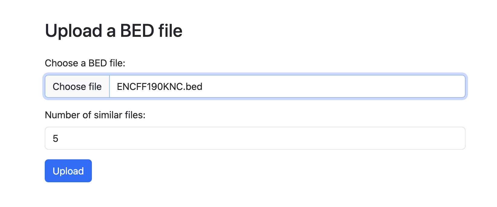
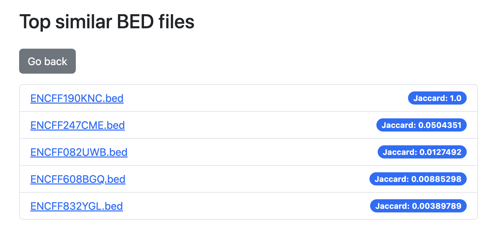
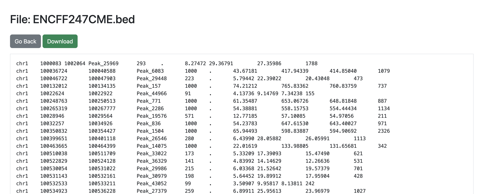

# Intelligent search through public ChIP-Seq data

## Table of Contents

1. [Overview](#overview)
2. [Tech Stack](#tech-stack)
3. [Project structure](#project-structure)
4. [Setup and Installation](#setup-and-installation)
5. [Usage](#usage)
6. [FAQ](#faq)
7. [Contacts](#contacts)

---

## Overview

This project is a genomic interval lookup service that allows users to upload a BED file to database and find the most similar files using the Jaccard index as a similarity measure.







---

## Tech Stack

- Backend: Flask (Python)

- Database: PostgreSQL, MinIO for cloud storage

- Processing: bedtools for similarity measure

- Frontend: HTML, Bootstrap

---

## Project Structure

```bash
.
├── app/               
│   ├── data/                          # Main files for db
│   │   ├── ENCFF082UWB.bed
│   │   ├── ENCFF190KNC.bed
│   │   ├── ENCFF247CME.bed
│   │   ├── ENCFF608BGQ.bed
│   │   ├── ENCFF832YGL.bed
│   │
│   ├── templates/                     # HTML templates for the web interface
│   │   ├── file_details.html
│   │   ├── similar_files.html
│   │   ├── upload.html
│   │
│   ├── config.py                      # Project configurations              
│   ├── main.py                        # Flask server entry point
│   ├── minio_utils.py                 # Utilities for working with MinIO
│   ├── models.py                      # The logic of working with data
│   ├── wait_for_db.py                 # Db waiting script                        
│
├── docker-compose.yml                 # Connects cloud storage, database, and application.
├── Dockerfile                         # Instructions for installing dependencies and launching
├── README.md                          
├── requirements.txt                   # Required Python libraries 

```

---

## Setup and Installation

**Clone the repository:**
```bash
git clone git@github.com:YaroslavMayorov/chip_seq_data_search.git
cd chip_seq_data_search
```
---

## Usage

1. **Start the application:**
```bash
docker compose up -d --build
```

2. **Open a browser:**

  Go to the address **[localhost:5001](http://localhost:5001/)** .

3. **Upload BED file:**

  Select a BED file to upload, specify the number of similar files you want to see, and click "Upload".
  
  After that, you will see a list of similar BED files. In the right corner, you can see the Jaccard index for each file.

4. **View similar file:**

   Click on the file name to view its contents.

5. **Download similar file:**

   Near the file content, there is a "Download" button. Click it to download the file.

6. **Close containers and clean memory:**

Close and removes images and containers associated with the project:

```bash
docker compose down -v --rmi all --remove-orphans
```

Removes all build cache:
(**Warning**: This affects all projects, not just this one.)

```bash
docker builder prune -af
```
---

## FAQ

<details>
<summary><strong> Why did I choose this internship?</strong></summary>

I studied in a biology-focused class, so I have a strong background in biology. I have long wanted to work in bioinformatics, and this internship is a great opportunity for me.

For about two years, I have been working with Flask, developing various web applications, from simple projects to multi-page websites. You can see one of my projects here: [arthouserooms.pythonanywhere.com](https://arthouserooms.pythonanywhere.com/). 

Recently, I developed my wallpaper Telegram bot, @InspireWallBot, so I know how to work with server-side databases and deploy applications.

I also completed a data analysis course from Tinkoff and a machine learning specialization from Yandex, which gave me valuable experience working with data visualization. In addition, I prepared for the DANO Olympiad in data analysis, so I have a solid understanding of statistics, data processing, and interpretation.

I really want to join your team, because this topic is really close to me. I am ready to learn new things and help develop a useful tool for biological data research. I would be grateful for the opportunity to be part of this project!
</details>

<details>
<summary><strong> Command "docker-compose" not found. </strong></summary>

   Linux: 
   ```bash
   sudo apt update
   sudo apt install docker-compose
   ```

    MacOs: 
    ```bash
   brew install docker-compose
   ```
  
</details>

<details>
<summary><strong> What if port is unavailable?</strong></summary>

   By default app is on 5001, postgre is on 5432, and minIO is on 9000, 9090. Change the port in `docker-compose.yml`:
   ```bash
   ports:
      - "<your_port>:5000"
   ```
</details>

</details> <details> <summary><strong>Where are files stored?</strong></summary>
Uploaded files are stored in MinIO. You can see it on <a href="http://localhost:9090" target="_blank">MinIO Dashboard</a>. Sign in with MINIO_ROOT_USER as login and MINIO_ROOT_PASSWORD as password (they are in docker-compose.yml). 

</details>

<details>
<summary><strong> Why did you posted code with secret key and passwords? </strong></summary>
  I know that secret keys should be loaded from a `.env` file. However, this is just a test app. I included it directly in the code so that users don't have to create a `.env` file manually — it makes running the app easier.
</details>

<details>
<summary><strong> Why do you use PostgreSQL and MinIO? You could use SQLite for a local app.</strong></summary>

Yes, SQLite is more convenient and faster to implement for local applications. However, I wanted to make the app closer to a real production setup and demonstrate that I know how to work with the tools typically used in such environments.
</details>

---

## Contacts 

If you have any questions, feel free to contact me:  

- **Email:** sasha.val2006@gmail.com
- **Telegram:** @thedreamertype


